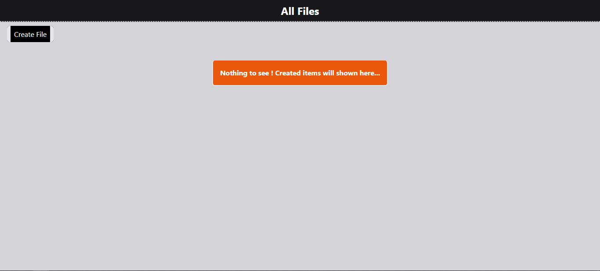

# File Management App

## [Live link](https://file-manager-c1cp.onrender.com/)


Welcome to my File Management App! This project allows users to create, view, rename, and delete files of various types (txt, html, css, js, md) with a great user experience. It is built using Node.js, Express, EJS, and the `fs` module.

## Table of Contents

- [Introduction](#introduction)
- [Features](#features)
- [Technologies Used](#technologies-used)
- [Installation](#installation)
- [Usage](#usage)
- [Project Structure](#project-structure)
- [Screenshots](#screenshots)
- [Future Enhancements](#future-enhancements)
- [Contributing](#contributing)
- [Contact](#contact)

## Introduction

This File Management App is designed to provide users with an intuitive interface to manage their files. Users can create files of types such as `.txt`, `.html`, `.css`, `.js`, and `.md`. The app also supports viewing, renaming, and deleting files, all implemented with a focus on user experience.

## Features

- **Create Files:** Create files of type `txt`, `html`, `css`, `js`, and `md`.
- **View Files:** List all saved files with their respective content.
- **Rename Files:** Rename existing files to a new name.
- **Delete Files:** Delete any file from the list.
- **User-Friendly Interface:** Intuitive and easy-to-use interface for managing files.

## Technologies Used

- **Node.js:** JavaScript runtime built on Chrome's V8 JavaScript engine.
- **Express:** Fast, unopinionated, minimalist web framework for Node.js.
- **EJS:** Embedded JavaScript templating.
- **fs module:** File System module to interact with the file system.

## Installation

To get started with the File Management App, follow these steps:

1. **Clone the repository:**
   ```bash
   git clone https://github.com/MrKuldeep01/notecreator.git

   cd file-management-app

   npm i
   ```


## Screen shots : 
### home page -

### home page with files -

### create route -

### Rename route -

### Delete route -


### explore for more fun 😎